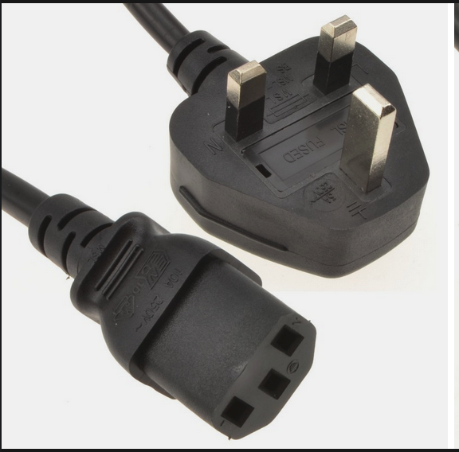
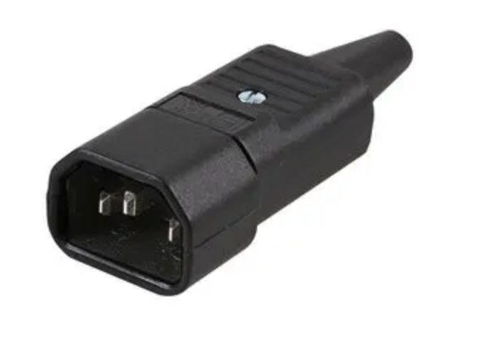
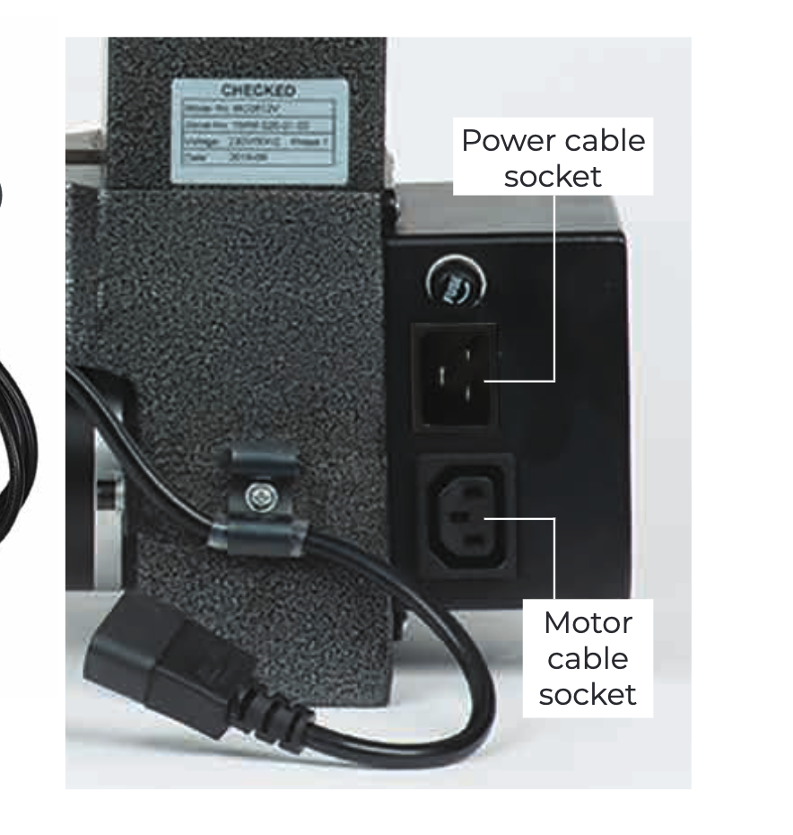
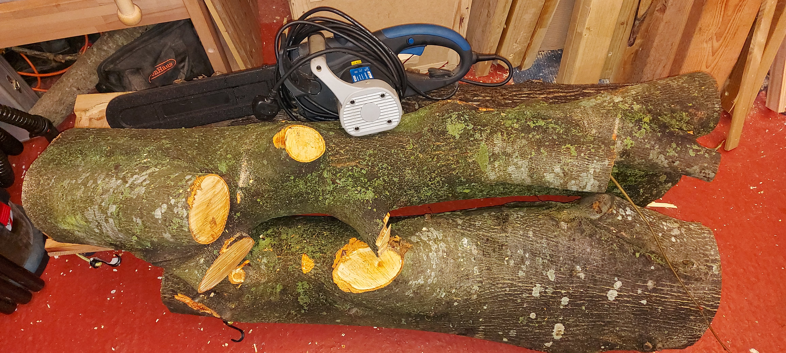
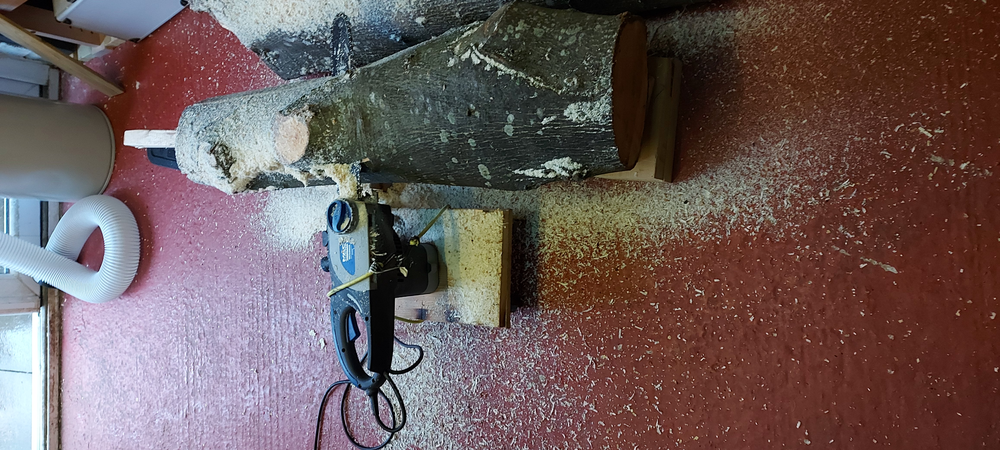
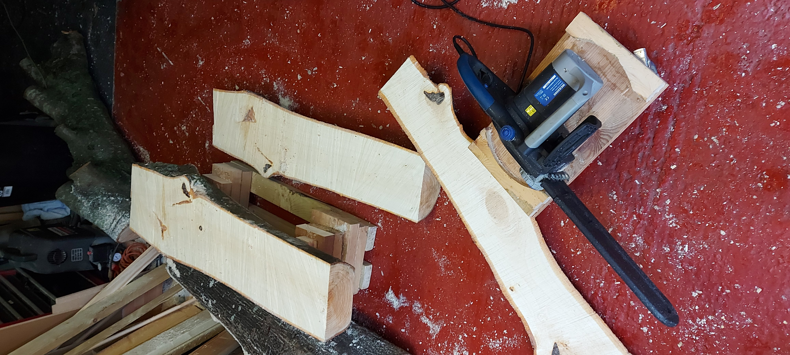
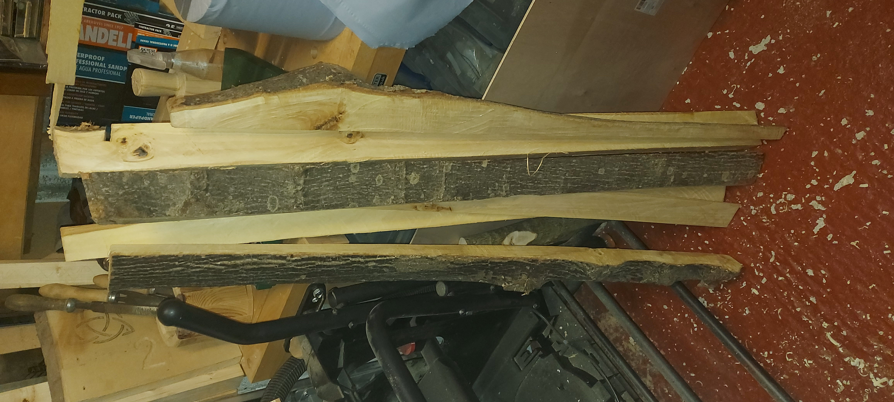

I have been talking about buying a lathe for a few years now. Mostly I have wanted a lathe to turn pens, but I have always thought I would turn bowls as well.

One of the problems that has stopped me buying a lathe before has been where on earth I would put it?

My workshop isn't that large and it already has a lot in it (too much really).

Claire bought me a lathe for christmas 2023, with starter tools a bowl blank and some pen blanks.

it's a nice compact (read small) lathe that could actually sit on a black and decker workbench, and thats where I intiallaly set it up.

setup consisted of getting the main body of the lathe out of the box and putting it onto the workbench, adding the toolrest and plugging it in.

here comes my first mistake (and yes, there will be plenty more) !

there was a power lead in the box,

and the motor had a socket (on an short cable) that the power lead could plug into.

so, like any good enthusiast, I plugged them together without really reading the manual (the manual was A5 black and white and not easy to read, at least that's my excuse)

Plug the mains cable into the mains electric and the machine started to vibrate. Oh, that doesnt seem right.

I only let a little bit of the magic smoke escape from the motor before my wife noticed and I unplugged it.

hmmm, seeing smoke doesnt seem good. I turned the lathe around to get a better look at the rear of the machine, and what do you know there are two places connectors on the back one of which can take a mains plug and the other can take a mains socket:

why couldnt they make the connectors on the back of the lathe the same so that you couldnt plug the (DC) motor into the mains cable ? it's like they are testing people to see if they read the manual (and I failed).

Anyway, once I'd sorted the power cables out, the lathe started. Brilliant, now I have a lathe, but my wife didnt know that a face shield was rather important, so I ordered one and waited (impatiently) for it to arrive.

Once the face shield arrived, I could actually try to turn something !

but turn what?
well, a few years ago some roadworks started along my road (to widen it to add a bus lane). Part of this work was cutting down all the trees (and re-planting them later) [http://www.stokegiffordjournal.co.uk/2021/01/19/felling-trees-gipsy-patch-bus-lane-set-start-soon/].
When the workmen were cutting the trees down, I asked what they were doing with them and they told me that the trees were getting chipped, so I cheekily asked them if I could have one of the trees.

They said Yes, and later that day a complete tree trunk appeared on my drive. The workmen had even tidied it up and got rid of the crown and smaller branches (which looking back I could have used a lot of it, but back then I didnt have a lathe and was planning on turning it into planks).

so, after work, I got my chainsaw out to cut it in half so that I could move it into my garage to dry out.

and of course, wouldnt you know it, the chain isnt cutting. So I checked the tension, had a good look and it all seemeed to be working correctly, but it still wouldnt cut that tree.

did a quick google and guess what; I had the chain on the wrong way round, so swap the chain around and that tree trunk was in two in no time.

that weekend I rigged up the chainsaw on a small wheeled platform that I had for my shop vac and sliced one half of the tree into some fairly uneven planks. I kept all of the outside pieces hoping that I would be able to use them in future.

I then read up on drying wood, and foudn out that it takes about a year for the wood to dry out and that I should aim for a moisture content of around 15%.

I didnt have much space in my garage (still dont actually) and so the planks were not stored flat, I didnt seal the ends and basically I just left them in a corner standing on end to dry out. The other half of the trunk wasnt cut up and just left in the garage to dry out.

[images]()

back to the present, and I realised I can use the offcuts from the planks I cut to create small spindle blanks for pen turning. So I ordered a pack of 5 pen kits (from amazon) and when they arrived, I followed the instructions (mostly) and cut a blank in half and drilled a hole through it. I couldnt find the chuck key for my pillar drill, so I used a hand drill and manually drilled the holes in the blanks. Luckly I had made the blanks quite a bit larger than the pen blanks you buy (bought ones are around 19mm square and mine were at least twice that). As the blanks were a bit on the large size (like me really), it didnt matter that the hole I drilled wasnt completly straight.

[images]()
