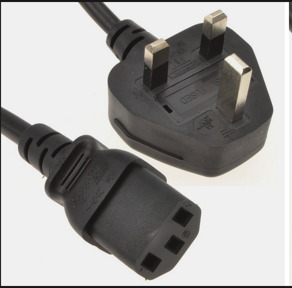
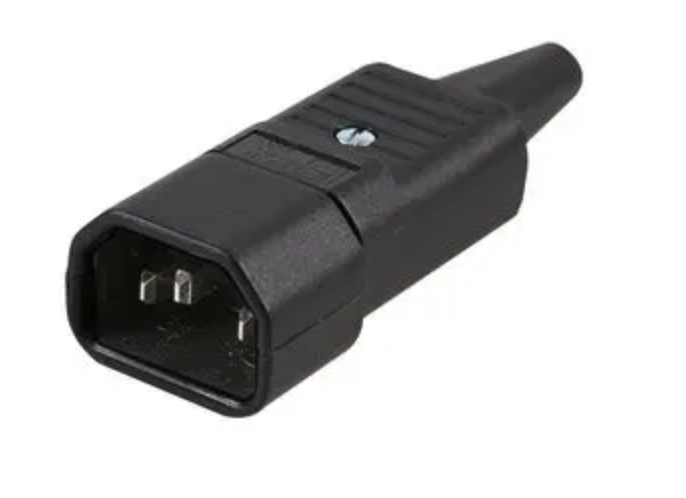
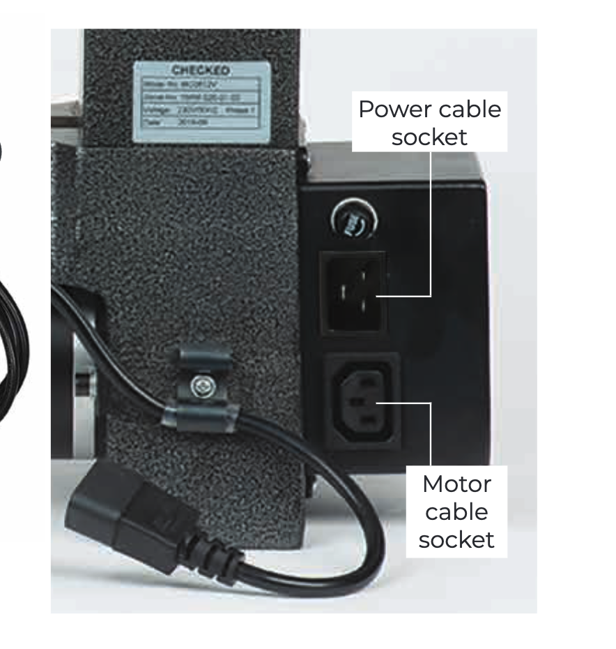

I have been talking about buying a lathe for a few years now. Mostly I have wanted a lathe to turn pens,
but I have always thought I would turn bowls as well.

One of the problems that has stopped me buying a lathe before has been where on earth I would put it?

My workshop isn't that large and it already has a lot in it (too much really).

Claire bought me a lathe for christmas, with starter tools and some pen blanks.

it's a nice compact (read small) lathe that could actually sit on a black and decker workbench, and thats where I intiallaly set it up.

setup consisted of getting the main body of the lathe out of the box and putting it onto the workbench, adding the toolrest and plugging it in.

here comes my first mistake !

there was a power lead in the box, 

and the motor had a socket (on an short cable) that the power lead could plug into.

so, like any good enthusiast, I plugged them together without really reading the manual (the manual was A5 black and white and not easy to read, at least that's my excuse)

Plug the mains cable into the mains electric and the machine started to vibrate. Oh, that doesnt seem right.

I only let a little bit of the magic smoke escape from the motor before my wife noticed and I unplugged it.

hmmm, seeing smoke doesnt seem good. I turned the lathe around to get a better look at the rear of the machine, and what do you know there are two places connectors on the back one of which can take a mains plug and the other can take a mains socket:

why couldnt they make the connectors on the back of the lathe the same so that you couldnt plug the (DC) motor into the mains cable ? it's like they are testing people to see if they read the manual.

