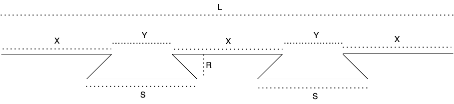

3D Design Mathematics.


When designing some of my woodworking jigs to be 3d printed I wanted them to be able to be larger then the maximum size I could print in one piece.

In freecad you can use a spreadsheet to store and calculate numbers that can be used as dimensions in the designs.

so I wanted to look into how I could calculate joints between parts to allow them to be glued together to make a single piece larger than my print bed.

I will start with joining parts on straight faces.

as a woodworker, I like dovetail joints and they also locate parts nicely together, so I'll use dovetail joints for my parts.

while a single dovetail would probably work, I decided to go with two dovetails as I believe it will be nicer (once glued I dont think there will be any difference in strength, so it's just an arbitrary decision I have made.)

so the dovetail will in my part will look like this:



now back to the maths (I know, I didnt really want to do this, but once I've got this worked out and in a spreadsheet I can forget all about it)

so we have (or at least I want)

1. `L = 3x + 2y`
2. `R = S / 2`  (or maybe `S / 3`, I can adjust this later)
3. `S = X`

so if the two faces to join together are 100mm long (`L = 100mm`)

1. Swap sides so that all variable terms are on the left hand side.
* **`3x + 2y = 100`**

2. Subtract 2y from both sides.
* **`3x = 100 − 2y`**

3. Divide both sides by 3.

graph LR;
    A("$$\frac{3x}{3} = \frac{100 - 2y}{3}$$")

```
3x ​  100 − 2y​ 
-- = --------
 3      3
```
 1. Dividing by 3 undoes the multiplication by 3.

graph LR;
    A("$$x = \frac{100 - 2y}{3}$$")

```
   ​  100 − 2y​ 
 x = --------
        3
```
