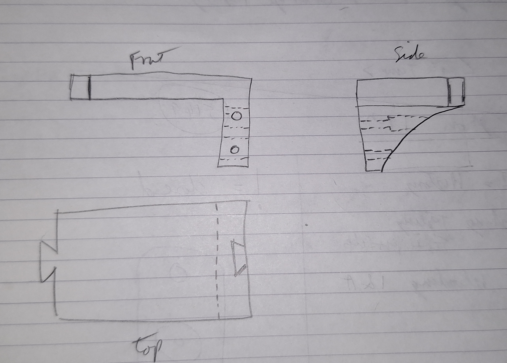
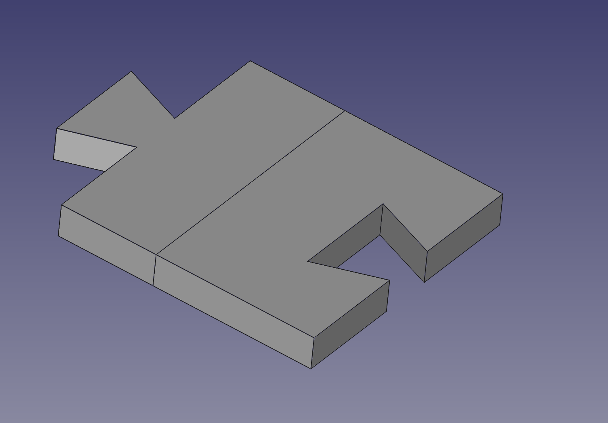
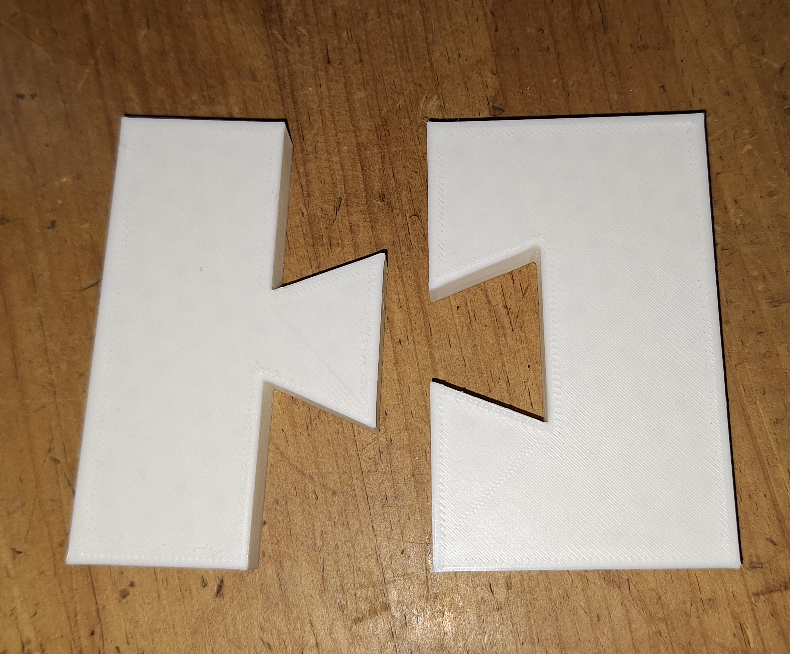
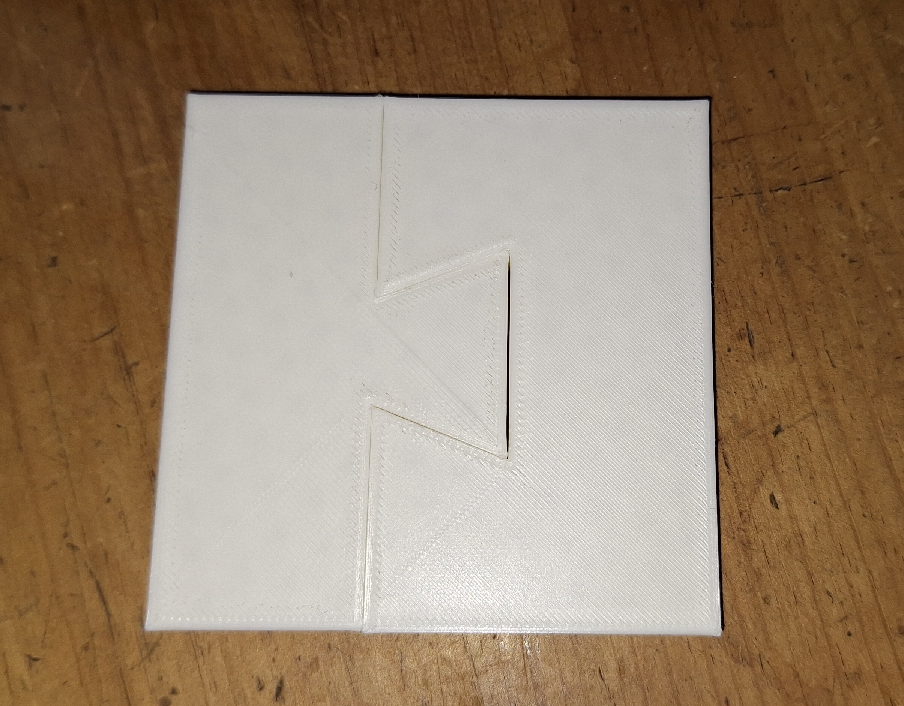
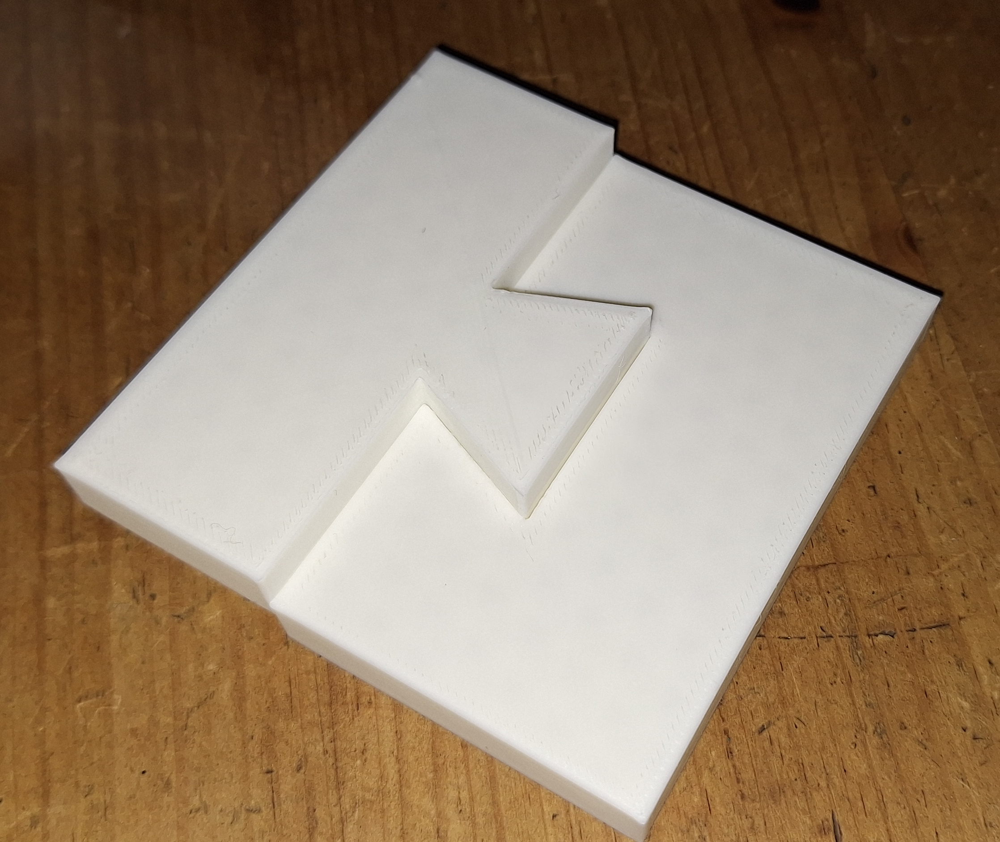
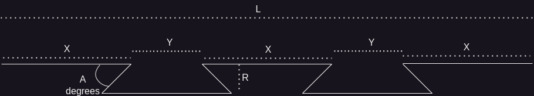
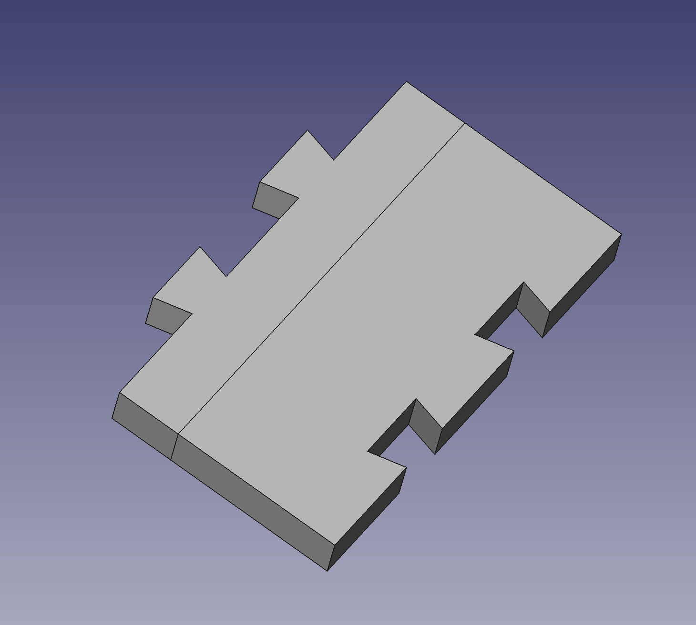
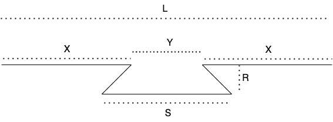
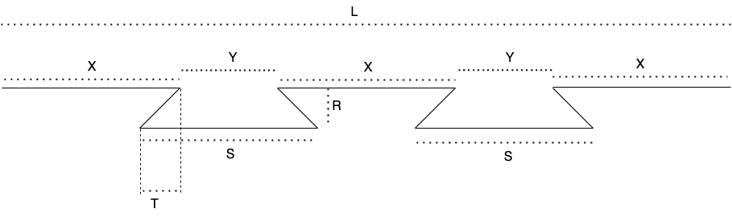

3D Design and Mathematics.

I am learning 3d design so that I can create my own parts to 3D print. I have started with some simple designs (which are all available on [Printables](https://www.printables.com/@MrSpaceman_244086)).

For all of my current designs I have made sure that they fit on my printer bed, which is 22 cm by 22 cm square. 

When using my [crosscut jig](https://www.printables.com/model/827909-magnetic-crosscut-saw-jig), I realised that I would like it longer than it's current design and started thinking about how I could design it so that it could be made longer by joining multiple parts together.

I did start thinking about this, but didn't get very far.

recently I have thought of creating a shelf that could be any length by joining multiple parts together:

This led to to actually try out a simple [test dovetail joint in FreeCAD](https://www.printables.com/model/984253-test-piece-for-dovetail-joint), and while I was printing that design I decided to write this article.

that design was made up as I went along, and I thought I could document it here afterwards. that turned out to be more difficult than I had initially thought.

This is the  single dovetail test piece:

which worked as you can see here:

This article was meant to show the process of trial, error and calculations that led me to my current design for joining two 3d printed parts together.

I started with the double dovetail in my **Original Article (below)**, but when I tried to put the design into FreeCAD, I realised that I had missed putting in the distance from the pin (**S**) to the edge and the result is that the pin can end up in the wrong place.

Also, whilst writing the original article, I realised that if I specifed the angle (**A**) and size (**R**) for the dovetail then the pin would end up in the correct position automatically, so that led me to update the double dovetail using the angle and it looks good so far.

This is the final design in FreeCAD:

-----
## Original article below

When designing some of my woodworking jigs to be 3d printed I wanted them to be able to be larger then the maximum size I could print in one piece.

In [FreeCAD](https://www.freecad.org/) you can use a [spreadsheet](https://wiki.freecad.org/Spreadsheet_Workbench) to store and calculate numbers that can be used as dimensions in the designs.

so I wanted to look into how I could calculate joints between parts to allow them to be glued together to make a single piece larger than my print bed.

I will start with joining parts on straight faces.

as a woodworker, I like dovetail joints and they also locate parts nicely together, so I'll use dovetail joints for my parts.

while a single dovetail would probably work, I decided to go with two dovetails as I believe it will be nicer (once glued I dont think there will be any difference in strength, so it's just an arbitrary decision I have made.)

for my first try I created a test piece with a single dovetail:

I did this one without thinking about the maths first, and this is the design I came up with:

so if the two faces to join together are 100mm long (`L = 100mm`)

next I will attempt a double dovetail:

now back to the maths (I know, I didnt really want to do this, but once I've got this worked out and in a spreadsheet I can forget all about it)

so we have (or at least I want for now)

1. `L = 3X + 2Y`
2. `X = 2Y`
3. `R = S / 3`
4. `S = X`

so if the two faces to join together are 100mm long (`L = 100mm`)

1. if `L = 3X + 2Y` and `X = 2Y`

then

2. `L = 4X`, so `X = L / 4`
which means
3. `X = 100 / 4` therefore `X = 25`
now that we have `X`, we can calculate `Y`
4. given `X = 2Y`
means
5. `Y = X / 2`
which means
3. `Y = 25 / 2` therefore `Y = 12.5`

As we have already specified that `S = X`
we know that `S = 25`

with
`R = S / 3`

we get `R = 25 / 3` giving us `R = 8.33333...`

So we now have all of the measurements that we need to create a sketch in FreeCAD that allows two bodies to be joined together using dovetails.

actually no we don't have all the numbers we need.

when we 3d print two parts to join together we cant use the same values for the socket (hole) and the pin side as the pin would not fit into the hole (the edges would overlap), so we need a tolerance that we can either increase the hole by or reduce the pin by (or we could do both and halve the tolerance value)

for my Creality Ender 5 S1 printer, I am using a tolerance of `0.3mm` and this seems to work well. It gives a tight fit (that sometimes needs a little sanding), but I can get the joint together.

so the values for my FreeCAD spreadsheet are this:

|     |   A    |   B   |
|:---:|:------:|:-----:|
|  1 | test part length (L) | 100 |
|  2 | test part width      | 80 |
|  3 | test part padding    | 5 |
|  4 |   |   |
|  5 |   |   |
|  6 | Dovetail hole spacing (X)   | =B1 / 4  |
|  7 | Dovetail hole Gap (Y)       | =B6 / 2  |
|  8 | Dovetail hole width (S)     | =B6      |
|  9 | Dovetail Depth (R)          | =B8/3    |
| 10 | Dovetail hole pin Width (T) | =B9      |
| 11 |   |   |
| 12 |   |   |
| 13 | Dovetail pin spacing (X)   | =B6  |
| 14 | Dovetail pin gap (Y)       | =B7  |
| 15 | Dovetail pin width (S)     | =B6      |
| 16 | Dovetail pin depth (R)     | =B9    |
| 10 | Dovetail Pin Width (T)     | =B9      |
| 18 |   |   |
| 19 |   |   |
| 20 | 3d print tolerance        | 0.3     |
| 21 | 3d print half tolerance   | =B20/2  |
| 22 |   |   |
| 23 |   |   |
