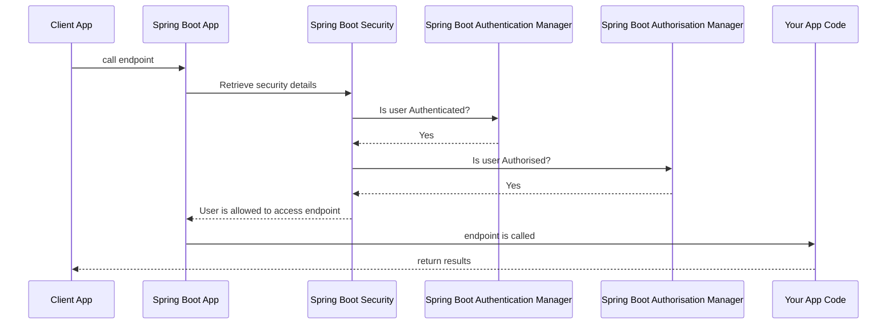

So, you have your (first?) spring boot app and would like to make it a bit more secure.

First you need to decide just how this app will be used. You probably all know this already as either your spring boot app exposes an API with no UI, or it exposes a UI that people can interact with.

We'll deal with the API only spring boot app for now. What this means is that users will not (usually) be calling your API endpoints directly. There will be another system that is calling your endpoints. that system will either be another service or a UI.

we are all used to using a username and a password (hopefully with MFA) to log in to systems, but passing usernames and passwords around could make them susceptible to leaking into the wrong hands. Of course the username and password have to be passed to a system that checks that they are correct, but once they have been checked we can then use **tokens** that have been cryptographically signed to check that the user is who they say they are.

This leads us nicely into the two aspects of securing any software system.

1. **Authentication**
   
   This is verifying that the user is who they say they are.
   
   This means that we need to make sure that the user who types in the username `johnsmith` is the user who registered that username. we do this by asking them to type in the password that they used when registering. This is something that only the registered user should know, but we should not rely on this alone as there are many ways for malicious people to get that information out of the registered user.
   
   This is where MFA (Multi factor authentication) comes in. The idea of MFA is that when trying to log in you use something you know (your password) and a physical item that you own. The physical item is less likely to be accessible to anyone else who is trying to log in to your account. 
   
   This physical item can be your phone or a physical dongle (like [Yubico](https://www.yubico.com/authentication-standards/), which uses the [FIDO](https://fidoalliance.org/how-fido-works/) standard).

2. **Authorisation**

   Authorisation is making sure that the user (who we have previously authenticated) is allowed to do what they are asking to do.
   
   This is likely set up in the authorisation server (especially if there is single sign on enabled) or your application. This says what people are allowed to do, e.g only people who are designated as administrators are allowed to add new users to the system. users can be given different authorisation levels such as a *read only* user, a *standard* user or an *admin* user. These roles are not necessarily exclusive, a user can have multiple roles assigned. for example, a user could have both the *read only* and *admin* levels applied and each might be relevant to different parts of the system.

so, now we know the difference between authentication and authorisation we can look into how that fits into a Spring Boot app (and other Spring based apps too).

For this article I will assume we are securing an API that does not have a UI with it.

## What we will be implementing



## Initialising the project for security
The first thing to do to secure a Spring Boot API is to include the Spring security library. Assuming you have already used the [Spring Initializr](https://start.spring.io/) to create your project and have some endpoints up and running we need to add the dependency into the list of libraries that your project is using.

I hope your using either gradle or maven, if not then it would be worth getting familiar with these as they are the most popular build tools for java projects (currently).

to add Spring security into your project you wil need to include the `spring-boot-starter-security` library which you do in gradle by adding the following line into your dependencies:
```
	implementation 'org.springframework.boot:spring-boot-starter-security'
```
or in maven by adding this block into your pom.xml
```
<dependency>
    <groupId>org.springframework.boot</groupId>
    <artifactId>spring-boot-starter-security</artifactId>
    <version>3.3.2</version>
</dependency>
```

while your looking at your dependencies, you should make sure that they are all up to date as old dependencies can have vulnerabilities that have been fixed in newer versions.

if your not sure how to add these or where to add them, then you need to learn a bit more about the fundamentals of these tools so that you can work more efficiently with them in future.

If you run your API project it will start up but you will need to supply a username and password each time you access one of your endpoints. The default user is `user` and the password is auto generated each time the application is run. This is okay for development and to make sure that Spring security is enabled, but we need to configure the application so that we can change the usernames and set passwords that don't change on every reboot.

## adding users

To setup your application to have some users that you can use for testing we cann add a configuration directly into the code that sets username and passwords (I did say that this was just for testing)

so we will update the Spring security configuration to add two users. the first user `user` will have the password `password` and be a *normal* user.

the second user will be `user2` with the password `password2` and will be given an administrator role.

we will need a configuration class such as
```java
import org.springframework.context.annotation.Bean;
import org.springframework.context.annotation.Configuration;
import org.springframework.context.annotation.Profile;
import org.springframework.security.config.Customizer;
import org.springframework.security.config.annotation.method.configuration.EnableMethodSecurity;
import org.springframework.security.config.annotation.web.builders.HttpSecurity;
import org.springframework.security.config.annotation.web.configurers.AbstractHttpConfigurer;
import org.springframework.security.config.http.SessionCreationPolicy;
import org.springframework.security.core.userdetails.User;
import org.springframework.security.core.userdetails.UserDetailsService;
import org.springframework.security.crypto.bcrypt.BCryptPasswordEncoder;
import org.springframework.security.provisioning.InMemoryUserDetailsManager;
import org.springframework.security.web.SecurityFilterChain;

@Configuration
@EnableMethodSecurity
public class SecurityConfig {
}
```

(we will be using the dependencies later, but I thought they would be useful here for reference)

the [`@EnableMethodSecurity`](https://docs.spring.io/spring-security/reference/servlet/authorization/method-security.html) annotation is optional and only needed if you want to be able to secure any class and/or method and not just the REST endpoints that are exposed by your application.

to add users into the security that spring is using (and replace the default user that Spring provides) we will add a bean method such as the following
```java
    @Bean∂
    @Profile("!prod")
    public UserDetailsService userDetailsService(BCryptPasswordEncoder bCryptPasswordEncoder) {
       UserDetails user1 = User.builder()
                .username("user1")
                .password(encoder().encode("password1"))
                .authorities("ROLE_USER")
                .build();

        UserDetails admin = User.builder()
                .username("user2")
                .password(encoder().encode("password2"))
                .authorities("ROLE_ADMIN")
                .build();

        return new InMemoryUserDetailsManager(user1,admin);
    }

    @Bean
    public BCryptPasswordEncoder encoder() {
        return new BCryptPasswordEncoder();
    }
```
so what is going on here?
<<<<<<< Updated upstream
first I'm going to assume that you understand the [`@Bean`](https://docs.spring.io/spring-framework/reference/core/beans/java/bean-annotation.html) annotation, if not, then you need to go an learn about it as is it fundamental to configuring Spring Boot applications in code.
||||||| constructed merge base
first I'm going to assume that you understand the `@Bean` annotation, if not, then you need to go an learn about it as is it fundamental to configuring Spring Boot applications in code.

the `@Profile` annotation is making sure we **Do Not** use this in production as it is not secure. It's fine for tests and running locally so that you can implement and debug code, but it should never be used in production.
=======
first I'm going to assume that you understand the [`@Bean`](https://docs.spring.io/spring-framework/reference/core/beans/java/bean-annotation.html) annotation, if not, then you need to go an learn about it as is it fundamental to configuring Spring Boot applications in code.

the [`@Profile`](https://spring.io/blog/2011/02/14/spring-3-1-m1-introducing-profile) annotation is making sure we **Do Not** use this in production as it is not secure. It's fine for tests and running locally so that you can implement and debug code, but it should never be used in production.
>>>>>>> Stashed changes

the [`@Profile`](https://spring.io/blog/2011/02/14/spring-3-1-m1-introducing-profile) annotation is making sure we **Do Not** use this in production as it is not secure. It's fine for tests and running locally so that you can implement and debug code, but it should never be used in production.

we use the `.password(encoder().encode("password2"))` function so that the passwords that are stored in memory are encrypted and not stored in cleartext/plaintext (yes, I know the password is in cleartext in the source code, but we are only using this for development and testing, so yes encoding it in memory is a bit redundant, but it shows the principle that we should encode stored passwords).

so, we now have two users available for securing our application, but how do we assign users to endpoints? For that we will add another function into the `SecurityConfig` class:
```java
    /**
     * Basic Security - not for production, but can be useful for testing
     */
    @Bean
    @Profile("dev")
    public SecurityFilterChain securityFilterChain(HttpSecurity http) throws Exception {
        http
                headers(header -> header.frameOptions(HeadersConfigurer.FrameOptionsConfig::disable))
                .csrf(AbstractHttpConfigurer::disable)
                .formLogin(AbstractHttpConfigurer::disable)
                .authorizeHttpRequests((requests) -> requests
                        .anyRequest().authenticated()
                )
                .httpBasic(Customizer.withDefaults())
                .sessionManagement(httpSecuritySessionManagementConfigurer ->
                        httpSecuritySessionManagementConfigurer.sessionCreationPolicy(SessionCreationPolicy.STATELESS));
        return http.build();
    }
```

this configuration tell Spring that any request (`anyRequest()`) that comes into this system has to be authenticated (see above).


If your app exposes a UI, then you will need some form of login screen and then some way of checking that the details the user entered are correct and that the user is allowed to do the things that they are trying to do. This, in the spirit of microservices (i.e. services are small and specialised) this would normally be handled by an external Authentication server (often an OAuth server).


## Other links that are well worth a read:
* [Spring guide on Securing a Web Application](https://spring.io/guides/gs/securing-web)
* [Spring's own guide on Spring securty](https://spring.io/projects/spring-security)
* [Spring Boot & OAuth2](https://spring.io/guides/tutorials/spring-boot-oauth2)
* [Storing Passwords](https://docs.spring.io/spring-security/reference/features/authentication/password-storage.html#authentication-password-storage-boot-cli)
* [OWASP REST Security Cheat Sheet](https://cheatsheetseries.owasp.org/cheatsheets/REST_Security_Cheat_Sheet.html)
* [OWASP REST Assessment Cheat Sheet](https://cheatsheetseries.owasp.org/cheatsheets/REST_Assessment_Cheat_Sheet.html)
* [Spring Security: Authentication and Authorization In-Depth](https://www.marcobehler.com/guides/spring-security)
