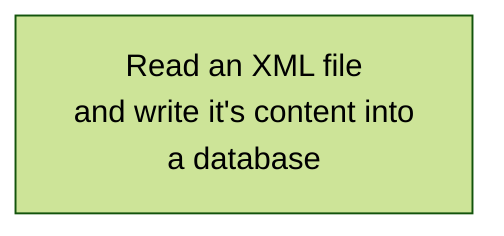
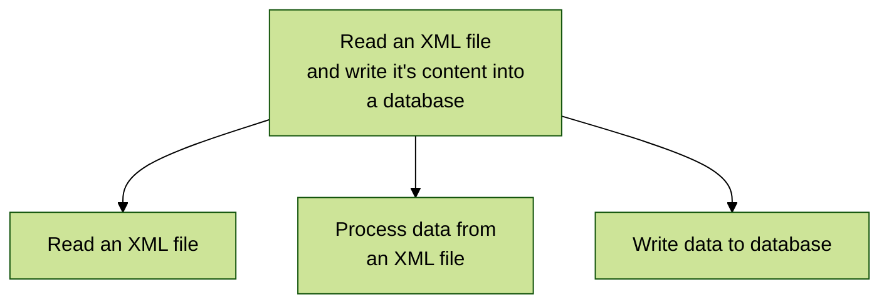
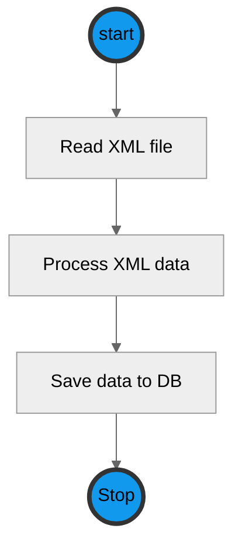
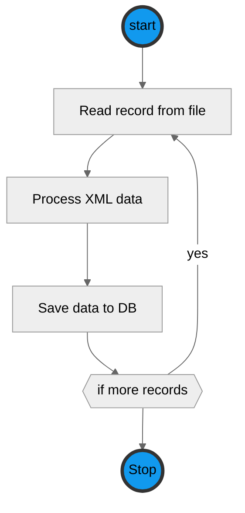
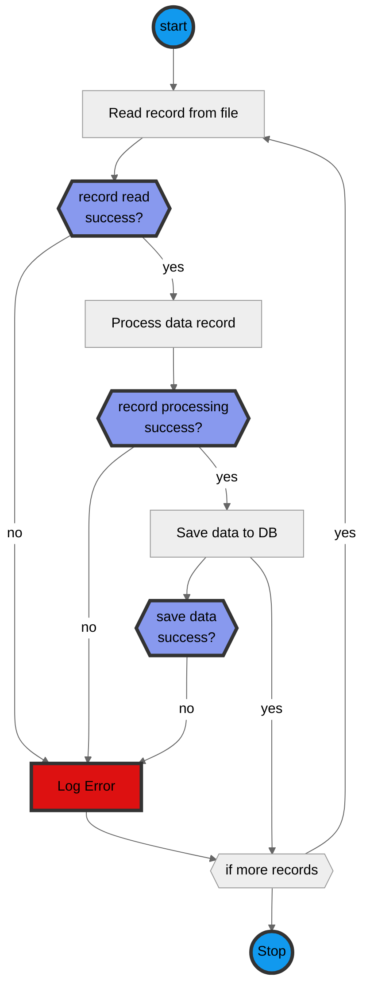

# Designing a system - part 02

This is part 10 of my ***Designing a system*** series of posts.

This series of articles is intended to give you a very basic idea of how to design a system from very high level down to designing how a module is implemented.

I'm starting with the lower level design of modules as I believe every programmer should understand how to read (if not help create) these sorts of diagrams.

I will (of course) be including some diagrams, and these have mostly been created with [Mermaid](https://mermaid.js.org/), but you can use whatever software you are most comfortable with.

Now when I started learning about programming, we were taught a diagramming technique called PSD, or Program Structure Diagram. This used a flowchart like diagram to decompose the problem down from a very high level statement into a more and more detailed statement for each part of the program.

Lets take a ***simple*** program : `Read an XML file that contains a list of data items and write it's content into a database`.

First we start with the problem statement (and this is actually a diagram, just a really, really simple one :) ):

This is the top level in our PSD chart, and it gives us a very high level overview of what we want this module to do. We next break that high level statement down into smaller parts and add those to the diagram, with the flow between the leaves being from left to right.

We would repeat that process until we have all of the functionality for the system written into boxes. we could even have each box decomposed to the level of being a single function (sub-routine) and written in pseudo-code.

This taught me to break problems down into smaller chunks, with each chunk being easier to understand and give more detail than the higher level chunks.

These days the PSD isn't used, but the thinking behind it (break a problem down into smaller more understandable chunks) is still very relevant.
Today I would do something similar, but I would use a UML activity diagram (basically a flowchart) like this:

seems reasonable, but we need to add in a loop so that we can read each data element in the file, so our next  version of the diagram might look like this:

looking better, But there are a lot of things that we need to consider when we look at this diagram:

1. Reading the XML file might fail
1. processing the XML data might fail
1. the write to the database might fail

so we can add these into the diagram:

We can continue to iterate over the diagram until we have as much detail as we need in order to write the software.

but this brings up one of the most important (and probably argued over) questions:

 * **How much detail is enough?**

