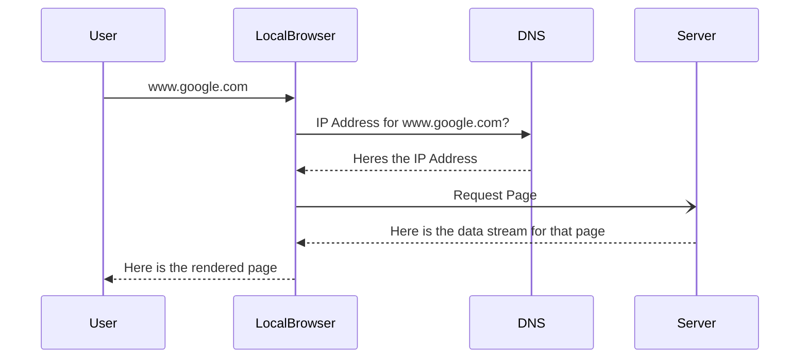
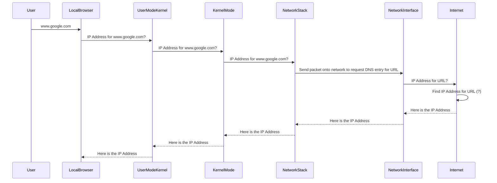

# Or "What happens when you type a URL into your browser"

I have been asked this question in a coupe of interviews now and I dont think I've given an answer that the interviewers wanted, so I thought I would write up an article on it to help others.

To answer this question there are a number of levels of detail we can go into here.

## The first and high level would be:
1. your browser goes to a DNS server to get the IP address of the server that hosts the URL you typed in
1. your browser connects to the server using the IP address and requests the page you asked for
1. the server sends the page back to your browser
1. your browser renders the page and displays it to you

Now this misses so much detail, but as I think I bombed on this question in interviews for going into too much detail, if all you want is to be able to answer this in an interview you can stop reading here (and I hope that the above answer works for you.)

But if you want to know more detail of what actually happens when you type a URL into a browser, then continue reading. Now there is the OSI model, but I will go into that later, for now lets look at what really happens when you type a string into your browsers URL bar.

the browser will (these days) have a look at the string that you have typed into the address bar and see if it thinks it is in fact a URL.

If it thinks that the string you typed in is not a URL, then it will perform a search for that string.

If the browser thinks that the string you typed in is a URL, then it will start the process of retrieving the data and displaying it to the user, and this is where it gets very complicated.

The browser is an application running on top of an operating system, so the browser itself doesn't talk directly to the network, instead it calls an function in the operating system kernel to get the ip address for a url. That sounds simple enough, but in the (linux, I'm not so sure about windows) kernel there are (at least) two layers, User mode and Kernel mode. The application; in this case the browser; is running in User mode and that helps the kernel maintain resources and security by not allowing applications to read/write memory and other system parts that are "owned" by other applications.

But we are not going to go into kernel architecture here, we just need to know that there are multiple parts as the browser application will make a request to get the ip address of a URL and the user mode of the kernel will talk to the kernel mode. the kernel mode will make sure that all of the applications that are requesting network data can all talk over the network interface at the same time and only see the data that they have requested.

So, to get the IP Address of a url it looks a bit like this:

How the kernel handles all of the applications that are talking to the internet at the same time and makes sure that each application only gets the data it requested is far beyond what we will go into in this article.

Now what I hope you also noticed is that I've skipped over the "Internet" part in the above diagram.

The internet part is actually a bit complex (as if it's been simple so far)

The internet is made up of network switches, routers, servers (and others that I wont mention here).

To get an IP Address for a URL, you need to talk to a DNS server (sounds easy doesn't it), but for the IP Address request packet to get to the DNS server it will pass through a few switches and routers (and probably hubs, but I wont worry about them).

This next but will change depending on your home network setup. In my setup I have a couple of switches in front of my internet router, so packets will pass through switches before getting to a router (and DNS cache). 

a network switch gets the IP Address request packet and has to decide where to send it. When a switch is first turned on, it doesn't know where to send any packets so if it receives a packet it will look at it's sender address and store it in a table so that it knows which interface that ip address is on. if it hasn't yet seen a packet from the destination address, then it will broadcast that packet to all interfaces on the switch.

lets summarise that a bit:
a network packet is made up of a few fields:

| Field               |
| ------------------- |
| Sender Address      |
| Destination Address |
| Payload             |

There are more fields than this, but these are the ones we are interested in. (if you do want to know more about the format of a network packet have a look [here](https://www.geeksforgeeks.org/computer-networks/tcp-ip-packet-format/))

The network switch looks at the Sender Address of all packets it receives and stores that ip address against the port it received it on. It does this so that it doesn't flood the network with packets when it knows where the destination is.

so, the packet has passed though a switch and on to the next part of it's journey. If you are at work or at home, there will probably be a router between your home/work network and the internet. A router is similar to a switch but connects two networks together (this is getting a but too into the weeds of networking, so I'll stop there, but if you want to know more have a look [here](https://www.cisco.com/c/en_uk/solutions/small-business/resource-center/networking/network-switch-vs-router.html#~switches))

## OSI model

