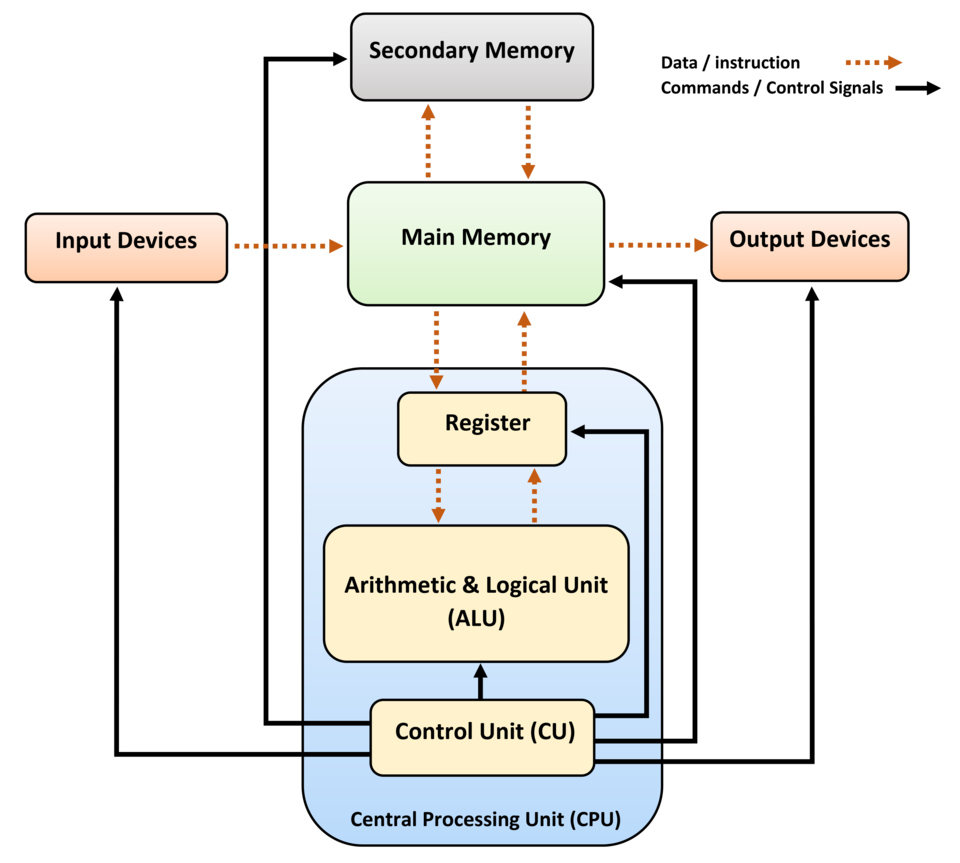

This article is going to give a basic understanding of what a programming language interpreter is and it's advantages and disadvantages.

# Introduction

All computers work the same way; a central processing unit (CPU) reads instructions from storage and executes them. 



(**The above image was taken from [this Wikipedia article](https://en.wikipedia.org/wiki/Computer_architecture)**)

The instructions that the CPU reads (from Main Memory) are just numbers. These numbers are called machine code as each number (code) corresponds to a different operation (well, some operations are made up of multiple numbers in sequence, but the general idea is the same).

so if the CPU only works on numbers, how does the text we type get executed by the CPU?

This is where compilers and interpreters come in. They translate the text we type for a language, be it BASIC, pascal, Fortran, Ada etc... into codes that the CPU understands.

so if we feed this into a python interpreter
```python
# This program adds two numbers

num1 = 1.5
num2 = 6.3

# Add two numbers
sum = num1 + num2

# Display the sum
print('The sum of {0} and {1} is {2}'.format(num1, num2, sum))
```

what the CPU will execute will look like this (and no, this isn;t the above compiled into machine code):
in hex
```
0x50
0x4A
0x14
0x32
0xF4
0x33
```
or binary
```
0110110110010100
0011010010100101
1010001000110011
1010010011010100
1010101101100010
0010000100101101
```

the machine code (as I hope you can see above) is not easy for us to understand. This is why programming languages were created.

I believe that the first programming languages were the class now called assembly languages and were introduced [around 1947](https://en.wikipedia.org/wiki/Assembly_language).
Each language was written for 
a specific CPU architecture and if you wrote some code in one assembly language for, say, a Sinclaire Spectrum ([Z80 CPU](https://en.wikipedia.org/wiki/Zilog_Z80)),
 then you would have to
write a whole new version if you wanted that program to run on a BBC Micro ([6502](https://en.wikipedia.org/wiki/MOS_Technology_6502)).

this is what assembly language looks like. the letters on the left are the operation that you want to perform and the parts on the right are
what you want to perform the operation on.

```assembly
# This program adds two numbers
MOV    CX, 0000
MOV    AX, [3000]    
MOV    BX, [3002]    
ADD    AX, BX    
JNC    2010    
INC    CX    
MOV    [3004], AX    
MOV    [3006], CX    
HLT
```

so the first line:
```assembly
MOV    CX, 0000
```
This means `Move` into register `CX` the value `0000`.

Assembly language was converted into machine code using anm Assembler. it does this by looking up the code for the instruction 
that you want to perform and putting that in a memory location, with the other parts of the operation (the operands) in the memory locations following it.
Once the Assembler has been executed against the code, then you get some machine code that can be loaded into memory (assuming it was written to a file) and executed.

## Moving On

Now as we are working at the level of the CPU, you need to understand how a CPU works to be able to write assembly language. That was fine when 
programmers were moving from machine code to assembly as they already understood how the CPU worked.

Also, when assembly was first being used there was no notion that computers were going to be so popular. 
There is a famous quote about "there is a world market for maybe five computers", which gets attributed to 
IBM, but I dont know how accurate that is (for more info see [this article](https://geekhistory.com/content/urban-legend-i-think-there-world-market-maybe-five-computers)).

This (kind of) shows that no one predicted that computers would be everywhere, and with so many different architectures.

But people did realise that getting a computer to do what they wanted it to do (programming it) would be easier if the language was
abstracted away from the hardware

