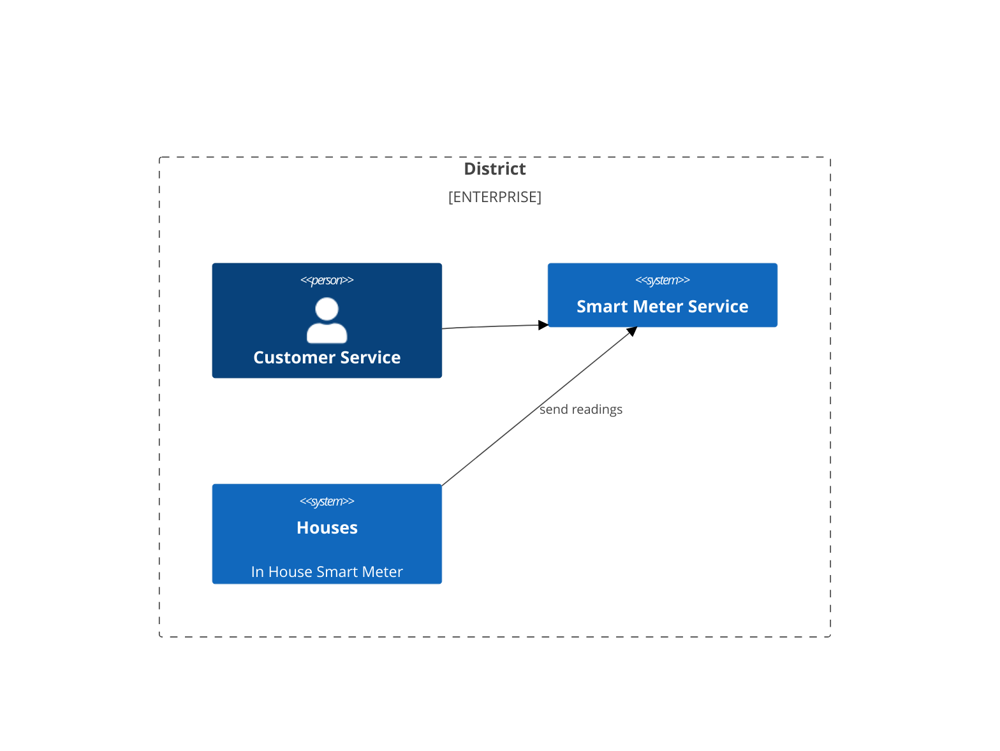
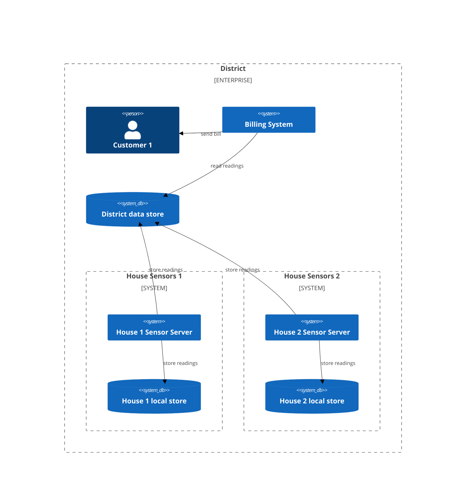

# Designing a system - part 01

So you want to start designing software as well as writing it (and testing it I hope). Where do you start?

Well, there are plenty of tools around, and even more web pages with lists of those tools, so I wont go into that. This article is about how do we design software, not which tool we do it in.

I will (of course) be including some diagrams, and these have mostly been created with [Mermaid](https://mermaid.js.org/), but you can use whatever software you are most comfortable with.

To design a system we have to start somewhere and the best place to start is with a very high level view of the entire system and how it fits into the wider world. This is called (in C4) a **Context Diagram**.

From here we will follow a simple process and break items down into smaller and smaller parts until we are happy that we have enough information to work from. We wont be going to the level where we specify classes to create as I feel that if we go down to that level of detail, then we are likely to have to change the design far too often as the code changes.

we should be looking at getting to a level that shows the system in enough detail that it can be implemented, but not so much that the design has to be updated too often.

the following context diagram is for a fictional smart energy meter reading system. This diagram shows where each house's smart meter sits in the 'context' of the larger system. In this system each house has a smart meter for measuring electricity and gas usage. Each smart meter has it's own small local data store for when it cant connect to the central system  (it can store readings for sending to the central data store later). The central data store is read by the billing system to create each house's gas and electric bill:

now that we can see where/how our new system sits in things, we can start to decompose the high level into more detailed component diagrams.
This is where we start to add more detail about the system we are designing.

