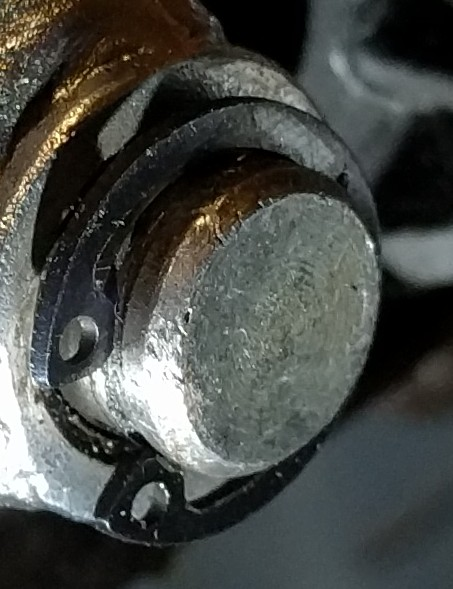
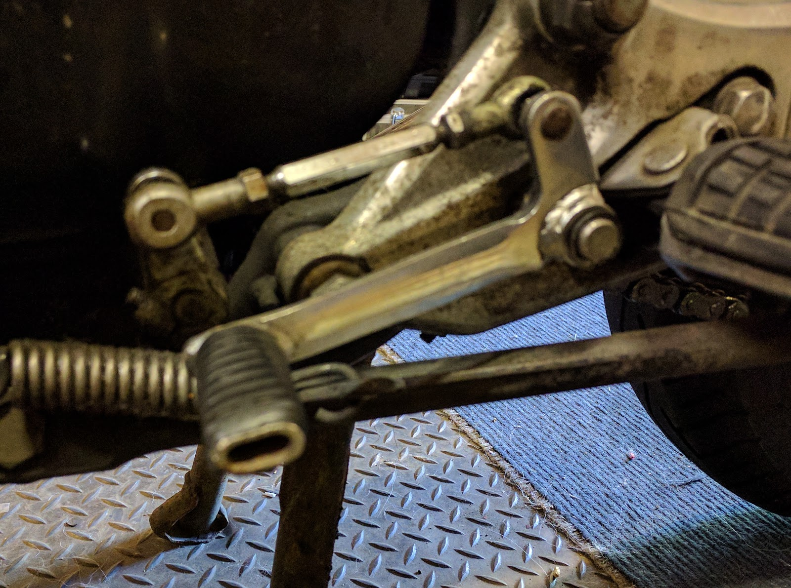

Just thought I would post a quick picture of the little devil that caused me so much trouble

I'll try to get a clearer picture soon, Clearer Image is here. You can see the little circlip that holds the lever onto it's pivot.

and there you can see the whole gear linkage.