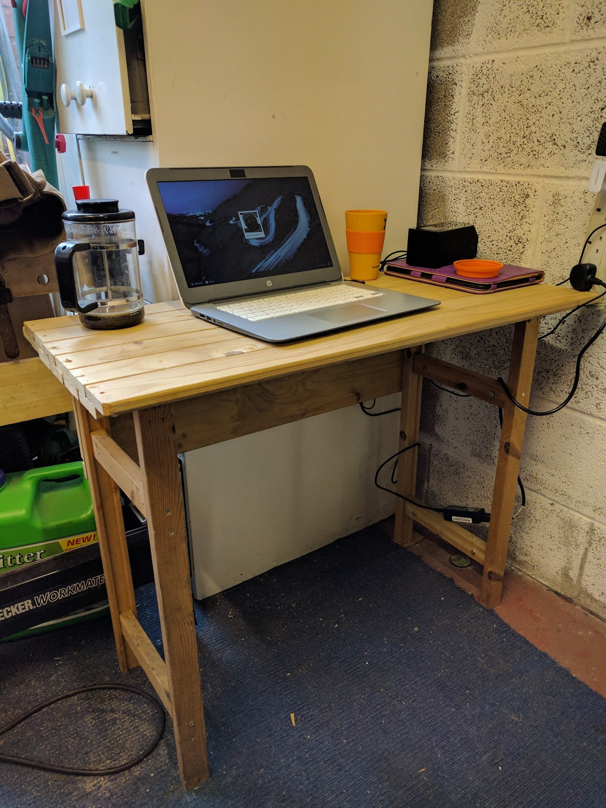

All of my writing up to this point has been done sitting in a Costa coffee on my Android tablet. of course the coffee there isn't free, so this was beginning to cost me a bit too much, especially if I want to write a little every day (as most people advise), so I had a look round my garage and found a small area that was just being used as a dumping ground. I thought "hmmm, it might just be big enough", so I cleared it out and measured it. it's small, but it's no smaller than a table at Costa, so should be big enough.

Next step, after sweeping the floor (its amazing the dirt that can accumulate if you don't move things around a lot). Anyway, where was I, oh yes next step was to make/get a desk that would fit the area. I have some scraps of wood laying around, and there were two ends of an old shelving unit. perfect for the ends of the desk, so I cut them down to size (with a handsaw as it was too early in the morning to be making too much noise).

I then had to dig out something to use for the desk top. looking through my wood pile, I found some old slats from a bed, but they were a bit too thin. okay, I have enough of them, I can glue them two thick into a single board, and if I overlap the slats then I wont need to edge joint them (I don't have wide enough clamps to edge joint).

so I carefully placed the first slat on top of another one and glued it into place. lots of clamps to make sure the glue would stick and it wouldn't move.

yes, I did just two slats at first. My thinking was that once the first two slats were in place, All of the rest would follow the same pattern as they are all half overlapping. so I left those first two slats to dry for a few hours (it was hot, so the glue dried quite quickly).

once the glue was dry enough, I took the clamps off and started putting the rest of the slats together. the desk top if (currently) six slats wide. I may see if I can find a few more as I would like a bit more room, but it works for now.

of course I could look through ebay for a "proper" writing desk, but this will suffice for now. its a bit wobbly, but a couple of bits of wood on each side would help with that. I can customise it as I want, so if I decide that I want a cup holder, I can drill out a large hole and voila, cup holder :)

here is a picture of the desk.

it's positioned so that I can look out into the garden if I want, and while I'm writing this, our dogs are playing, running up and down chasing each other.

to finish the writing experience, I have a cafetiere of coffee, for that authentic "Coffee Shop" feeling.

much better than sitting in a Costa I think.
