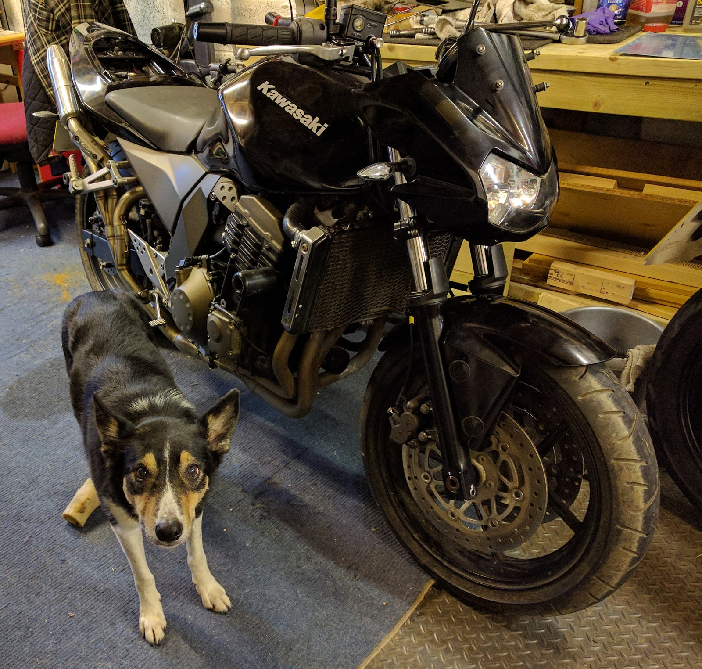

Just a quick picture of what it should look like to remind me !!

Between piston polishing I've been trying to get the sliders off the calipers, but they are stuck fast. I really can't see how to get these sliders out. I've been through the Haynes manual and it says the sliders should just slide off, there are no bolts or screws keeping it attached, but they won't budge.

Having now looked at the "Rebuild Kit Full Seals Caliper", one of the caliper slider pins has a rubber boot that goes through the hole and comes out the other side with the slider pin inside it. Seeing as I will be replacing all of the rubber bits on the calipers, I cut the end of the boot off so that I could get to the other side of the pin to see if I could push it through, but still no luck. still it did allow me to spray WD40 on the other side of the pin (I'd already sprayed some into the boot to try and free it).

so I carry on polishing the brake pistons while I think through how to get these sliders off.

looking at the rubber boot that the pin goes through, I thought that if I pull on the exposed bit of boot, it might help pull the slider pin out, so I cut the boot&nbsp;part of it, grabbed it with pliers and pulled.

I theorised that pulling on the boot would make the rubber inside around the slider pin thinner and lo and behold, the slider popped off (literally popped off and ended up on the floor). finally something going well. so that's the rear caliper completely dismantled.

So I try the same trick on one of the front caliper sliders and to my amazement, it worked (I really thought my luck would run out), so now the other front caliper. I tried to get a good purchase on the rubber boot with my locking pliers. once they were attached to the rubber, I pulled gently, but the pliers slipped off. whoops, okay a bit more pressure with the pliers and try again. so I start pulling and the rubber is stretching, looks like its going to work.

but of course it didn't work. something had to go wrong, and in this case, the rubber split around the pin and left me with almost no rubber showing, so no more rubber to grip to try my pulling technique. 

okay, what now? well, my wife suggested that I try heat to free the pin, so I have now ordered some gas for my little hand held butane torch, and when that arrives, we'll see what we can do.

