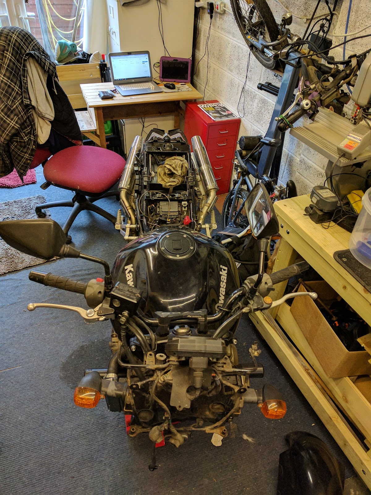

So now to move the bike so that I can lift the front end. I cant leave it on my bench as it has been lowered and I cant get my small lift under it.

So I'll have to get it off the bike bench, put it on paddock stands and then put the lift under it.

My wife helped me get if off the bench, as you really can't hold a motorbike up and loosen a wheel clamp at the same time.

Once it was on the floor, I put the rear paddock stand under it and tried the small lift to see if it would now fit. Yes. no need for the front paddock stand then. okay, now that the lift fits, I need to work out where on the engine it can lift. so I position it just under the exhaust downpipes and grab some blocks of wood so that the lift doesn't press on the exhausts, and the front end comes off the floor.

so now it's just a case of taking the front wheel and mudguard off, and dropping the forks out.

First thing to do is loosen the top of the fork while it is being held in by the front yokes. Next up I make sure that all of the front yoke bolts are loose, then I grab a 14mm hex bolt and try to undo the front wheel axle.

No joy. it's stuck fast. Typical.

so I spray some WD40 on the thread end (making sure it doesn't get onto the tyre), and leave it a while. then I sprayed some more and tried again. still no luck. Okay, more WD40 and I'll leave it overnight.

Next morning, before I head to work, I spray a little more WD40 and try to loosen it. Nope, still stuck.

when I got home, I decided to try a little heat, so I got a small blowtorch out and applied a small amount of heat and tried again with a hex key and a hammer.

I'm not sure if the WD40 had finally worked through, whether the heat had loosened the axle, or whether it was just the brute force of the hammer, but it moved.

Finally the front wheel came off. After that I could get to the nuts holding the mudguard on. They came free easily (which surprised me). and once that was off, I could loosen the yoke bolts and drop the forks out.

so the bike now looks like this:

