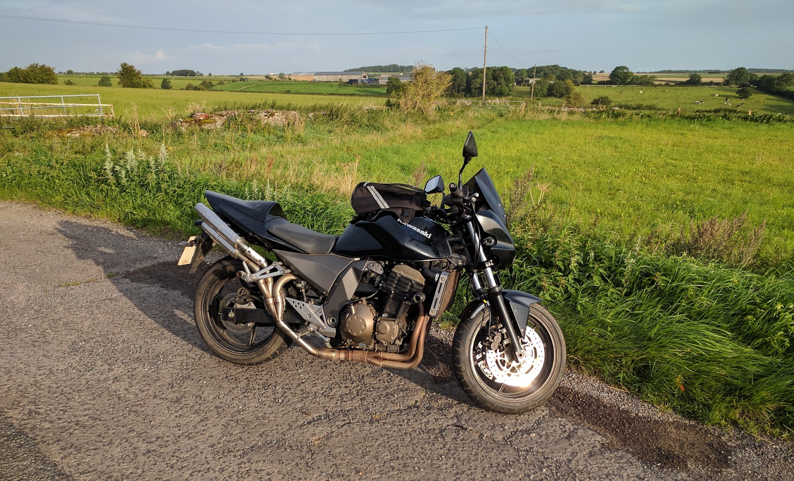

I took the bike for a quick test ride round the block and it was fine. it actually cornered now that I had sorted out the tyre pressures. and the brakes all work.

I gave the bike a quick look over and noticed that I hadn't marked the rear caliper bolts. (I mark each bolt when I tighten it up to the specified torque so that I can see if it loosens up. so if you look at my bikes you'll see white dots on a lot of the bolts.). As I hadn't marked it, I hadn't tightened it up fully, so I torqued it up and marked it.

The bike shop I use managed to fit my in for an MOT before they went off to the Isle of Man Classic TT, so that morning, I got my gear on, wheeled the bike out of the garage, said a quick prayer (I'm not religious, but it can't hurt), and I then put my life in my own hands.

I mean that even though I ride every day, I had never before done this much work on a bike. I'd changed braked pads, but never replaced the brake seals, and although I had torqued up the for retaining bolts, would they hold?

So I gingerly took the bike out onto the road. The first few miles were the worst as it was along slow roads with plenty of traffic lights and stops.

with the gear lever still playing up changing down to come to a stop was challenging. I had decided to leave home as early as I could and wait at the bike shop for them to open as the traffic would be lightest then. This helped in that I could go slower approaching lights and junctions and give myself more time to change gears.

Each down shift consisted of - Change down a gear, then fiddle my foot under the gear lever to try to get it back into he middle and not change back up into the gear I was trying to change down from.

It's only a couple of miles from my house to the motorway thankfully and once on the motorway I could just pootle along in top gear (yes it actually changed up into all the gears). once I got off the motorway and back onto the slower roads I was lucky that it is a straight run to the bike shop, so the gears didn't affect me too much.

I got to the shop and parked my bike up and could relax. The bike had got me there (it's around twelve miles to the shop). I stood around and read MCN until the owner arrived (earlier than I had thought). We had a quick chat, and then I left to get the train home.

It was a tense day, waiting to see what the bike would fail on. I really didn't expect it to pass). It was booked in for the MOT at 15:30, so I had all day to wait.

At just after 16:00, as we were on our way to the bike shop to see how it went, my phone rang. It was the bike shop (luckily my wife was driving, so I could answer).

The bike has passed. Wow, I'm gobsmacked.

okay, it still needs two new tyres and a chain, but it's back on the road. I had a look at the MOT report and the bike had done just under one hundred miles since it's last MOT in april 2011. and I have now put over two hundred miles on it in a couple of weeks.

I think it's happier now it's going to be ridden again.

Of course that leaves me with one question : Now what do I do?

I think that I'll keep the Z750 stock and move onto my next project - the CB750.

So here she is out for a quick ride.

