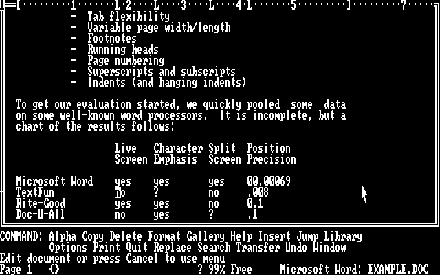
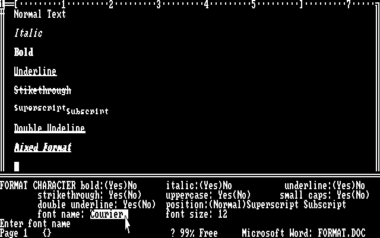
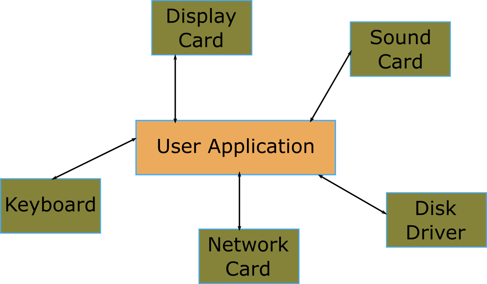
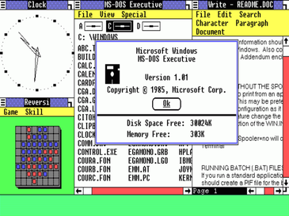
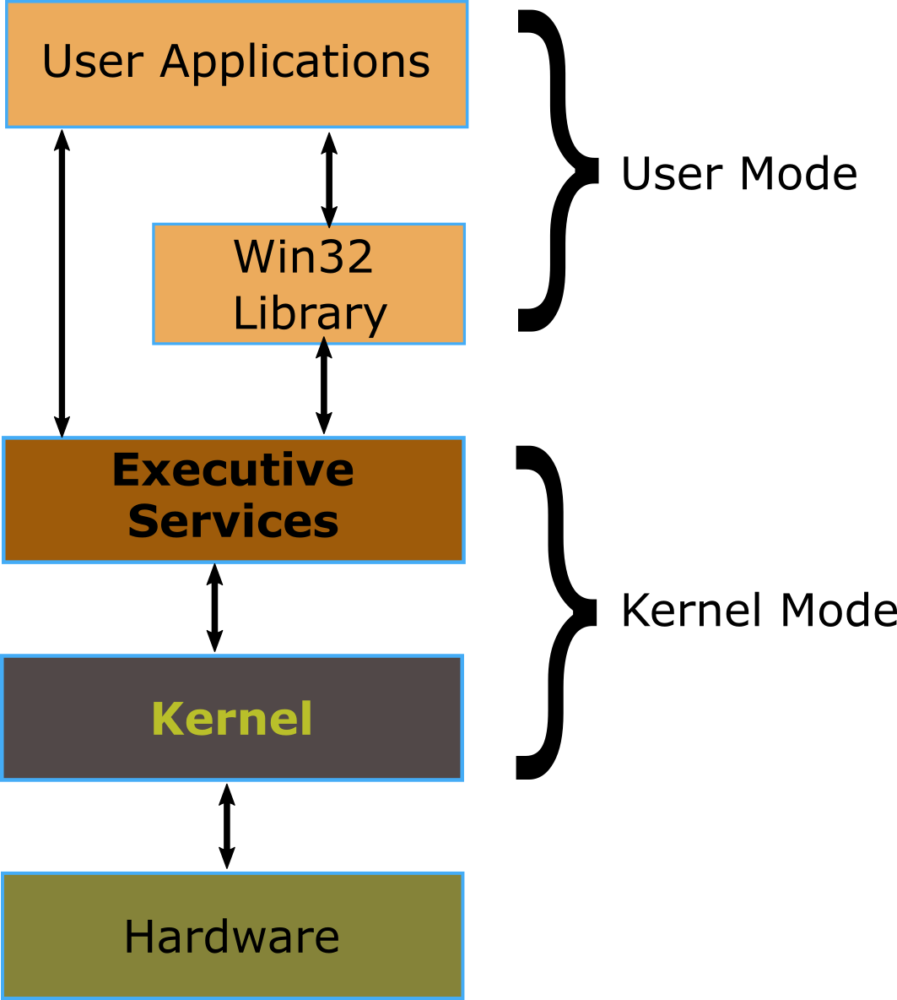
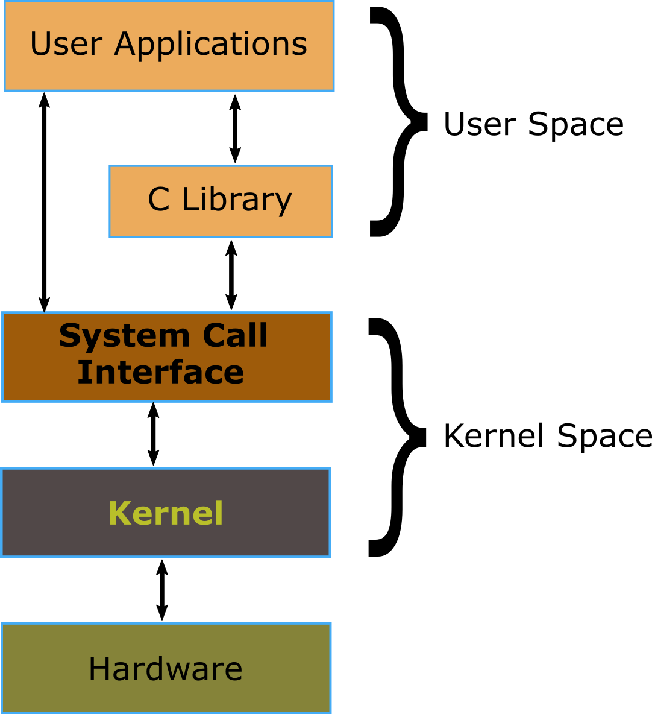
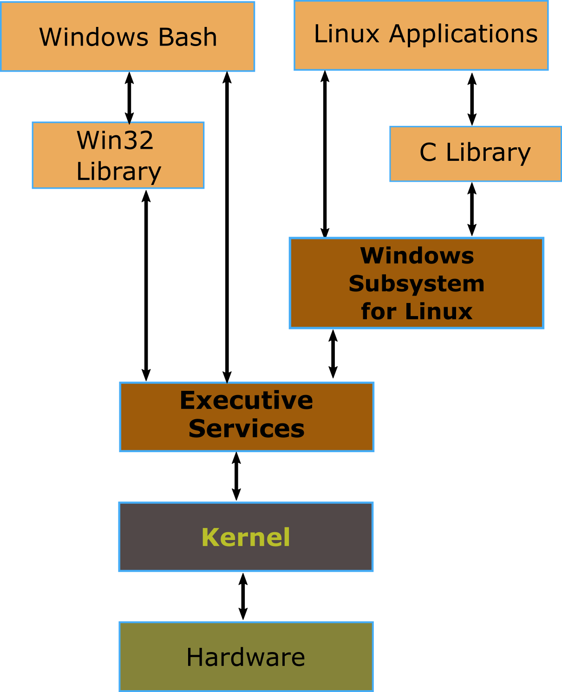

## Background

Windows Subsystem for Linux was developed by Microsoft to enable command line programs compiled for the Linux operating system to be executed on Windows.

To explain the architecture I would like to show the evolution of OS design and how that has enabled this subsystem to be built.

## Dark Ages (or Back in the Day)

Microsoft's MS-DOS was quite primitive in its design (compared to today's OS's). It is a single user OS that can execute one process at a time. DOS had an application programming interface to allow user programs to access some hardware in a device independent way, but only for character-based applications.

This allowed applications to display graphical elements emulated with text characters as these screenshots of Microsoft word for DOS show:

This is Microsoft Word version 1.

To use these programs you had to remember key combinations to bring up the menus and used the cursor keys to navigate around the screen.

If the application required fancy graphics, sounds or networking (or just wanted to allow the use of a mouse), then the application had to talk directly to that hardware using device-specific drivers.

If you changed your sound/network/video card, applications might stop working as they might not have drivers for it.

## Windows

On 20th November 1985 Microsoft launched [Windows version 1.0](https://en.wikipedia.org/wiki/Windows_1.0).

The first version of Windows ran on top of MS-DOS and presented a Graphical User Interface.

Windows 1 introduced the hardware abstraction layer into the PC application architecture. Windows 1 included drivers for video cards, a mouse, keyboards, printers and serial communications, and applications were supposed to only invoke The Windows APIs and not talk to the drivers directly.

The windows OS has evolved a great deal over the years and the original windows 1 architecture was still in use as the foundation of Windows ME release in 2000.

Starting in 1993 Microsoft created a purely 32 bit OS with no legacy code from Windows 1 architecture. The kernel created for Windows NT is still used as the base for current versions of Windows (although it has evolved since 1993).

This is the basic structure of windows today. User applications talk to a layer in the kernel that abstracts out all details of the hardware and presents a unified API to user applications.

## Linux

In 1991, Linus Torvalds, a student at Helsinki university wanted an OS where he could play with its source code and learn about its internals. He started using an OS called Minix written by professor Andrew Tanenbaum and documented in a book which was aimed at students learning operating systems design. While the source code for the Minix system was available, modification and redistribution were restricted.

This led Linus Torvalds to start writing his own OS which he called Linux.

The first message about Linux was actually posted to the comp.os.minix newsgroup on [25 Aug 1991 - First msg about Linux](https://groups.google.com/forum/#!msg/comp.os.minix/dlNtH7RRrGA/SwRavCzVE7gJ)

Linux has a similar architecture to current Windows versions. no user application accesses hardware devices directly not even by talking to device drivers. User applications talk to a layer in the kernel that abstracts out all details of the hardware and presents a unified API to user applications.

## Windows Subsystem for Linux

So, finally on to the subject of this post.

Microsoft hasn't always been a fan of Linux. Some people have even accused Microsoft of underhand tactics in the past designed to stop Linux being installed on PC's that also had Windows installed.

But eventually, they have realised that developers seem to like the open source OS and have started supporting it.

Windows Subsystem for Linux-August 2, 2016 ([Windows 10 Build 1607](https://en.wikipedia.org/wiki/Windows_10#Redstone_1)) 

the Windows subsystem for Linux was written to allow text mode Linux programs to be executed on windows.

"WSL executes unmodified Linux ELF64 binaries by virtualizing a Linux kernel interface on top of the Windows NT kernel"

Basically, it performs real-time translation of Linux syscalls into Windows OS syscalls.

So what it boils down to is that Microsoft wrote a Linux kernel 'emulator', which allows programs that call into the Linux kernel user-space API to execute on windows and not know it. But being only the Linux kernel, there are no graphics calls. Sorry but Xeyes won't run. Unix has a unique take on windowing systems. but that is a large subject and probably best left for another post. This one is long enough for now.

### References

[The Halloween Documents-1 Nov 1998](https://en.wikipedia.org/wiki/Halloween_documents)
