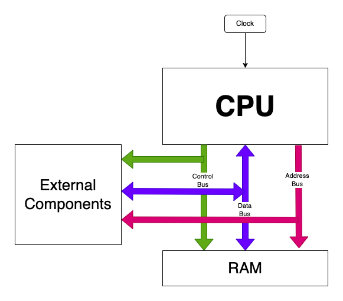
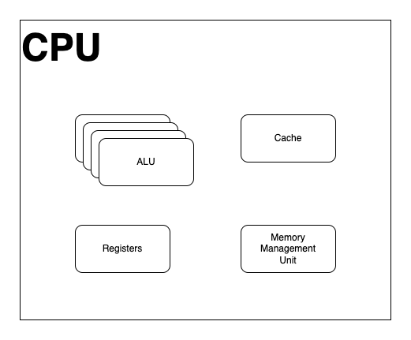

Computer architecture refers to the design and organization of the components that make up a computer system. It defines how these components interact and work together to process and execute
instructions. Here's a simple explanation of computer architecture:

1. Central Processing Unit (CPU): The CPU is the "brain" of the computer. It performs the actual processing of data and instructions. It consists of two main components:
   * Control Unit (CU): The control unit is responsible for fetching instructions from memory, decoding them, and controlling the flow of data between other components of the CPU and memory.
   * Arithmetic Logic Unit (ALU): The ALU performs arithmetic operations (like addition, subtraction) and logical operations (like AND, OR) on data received from memory or registers.
   * Clock
   * Cache: There is a small amount on (what is called on die) cache. There is only a very small amount as it is expensive to add memory onto the CPU.
1. Memory: Memory stores data and instructions that the CPU needs to process. It can be divided into two main types:
   * Primary Memory: Also known as RAM (Random Access Memory), it is the computer's main memory that is used to temporarily store data and instructions while the computer is running. It is volatile,
     meaning it loses its contents when the power is turned off.
   * Secondary Memory: This includes storage devices like hard drives and solid-state drives (SSDs). It is used for long-term storage of data, even when the power is turned off. Secondary memory is
     non-volatile.
1. Input/Output (I/O) Devices: These devices allow the computer to communicate with the outside world. Examples include keyboards, mice, monitors, printers, and network cards.
1. Bus: The bus is a communication pathway that connects all the components of the computer. It allows data to be transferred between the CPU, memory, and I/O devices.

This is a very simple diagram of a CPU:

* The Memory Management Unit (MMU) allows the CPU to access the main memory in the computer
* The Registers are basically a tiny bank of memory that can be addressed by the CPU. These "memory" locations can be accessed the fastest.
* the Cache is used to store a copy of a small amount of external memory. This memory is quicker to access than external memory. There may also be multiple levels in cache inside a CPU, with each
  "level" of cache being faster to access (an also more expensive).
* The ALU (Arithmetic and logic unit) is the component that performs arithmetic and logical operations. In modern CPU's there will be many of these, with some dedicated to integer arithmetic and some
  dedicated to floating point arithmetic.

Now, let's look at how a simple CPU executes instructions (called the fetch execute cycle):

1. Fetch: The CPU fetches an instruction from memory using the program counter (a special register that keeps track of the memory address of the next instruction to be executed).
1. Decode: The control unit decodes the instruction, determining what operation needs to be performed.
1. Execute: The ALU performs the operation specified by the instruction. For example, if the instruction is an addition operation, the ALU will add the specified operands.
1. Store: If the instruction changes the data, the result is stored back in memory or in a CPU register for temporary storage.
1. Repeat: The CPU repeats this process, fetching, decoding, and executing instructions one after another, in sequence, until the program is complete.

This is a simplified explanation of computer architecture. A google search will give you many weeks worth of reading if you want to go down that rabbit hole.
