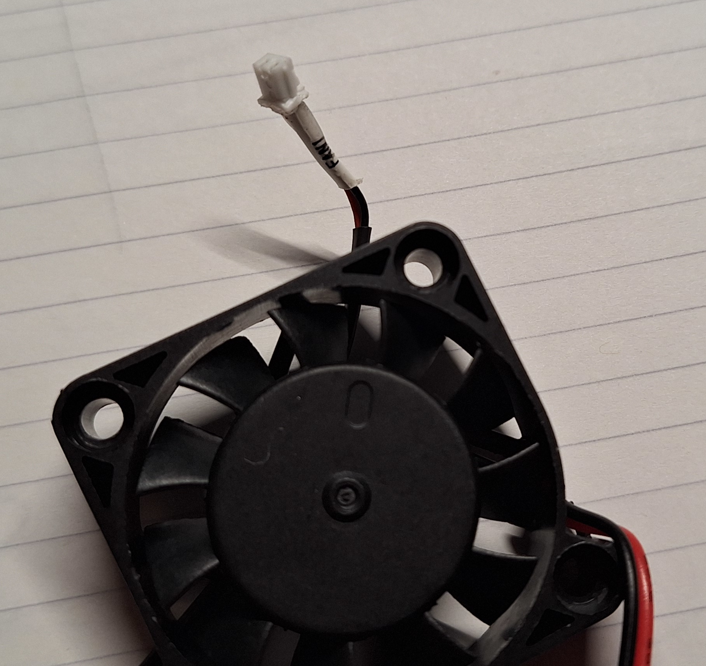
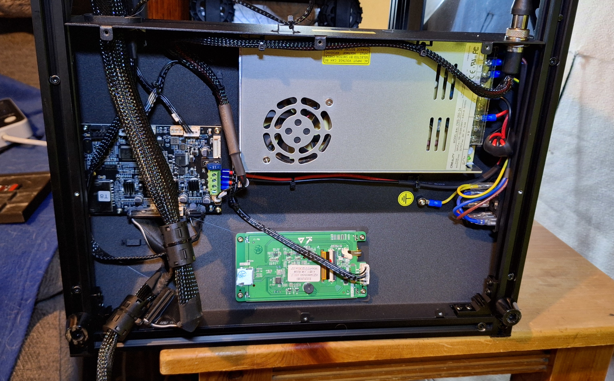

I bought a Creality Ender 5 S1 3d printer just about a year ago, and it has been printing most days since then without any issues
(well, apart from the bed level issue that seems to be down to the placement of the bl/cr touch, oh, and the fact that Creality launched better specced machines soon after the 5 S1 which I probably would have gone for instead had I just had a little patience).

But just after (or maybe before, the older I get the less I seem to remember) christmas It started playing up.

Looking at it, I thought the nozzle was blocked, so I put a new nozzle on (thats when I noticed that the old nozzle had actually worn down
enough for me to see easily, whoops), reset the Z-Offset, and tried printing again, but it still seemed to be blocked, so I tried pushing the filament through by hand 
and nothing, I could not push the filament through the hotend even when I ramped up the temperature, so I looked at bit more closely and noticed that the hotend fan wasn't working. Oh oh.

reading up a bit and I find that the hotend fan is supposed to turn on at 50 degrees centigrade and stay on while the hotend is above that temperature.

Well, mine wasn't coming on at all, and I realised that this would allow heat to creep up from my nozzle & heater block into the supposed cool zone. and if that heat was enough to melt the filament where filament should not be melted, this could be causing my issues.

So, I ordered a new complete hotend (as I knew mine was blocked) and new fans as I guessed that the fan had stopped working (well, thats the bit that wasnt turning round !!).

My plan was to replace the hotend and try to unblock the old one so that I would have a spare (something about mice, men and plans here, thank you Mr Burns).

So, the new hotend and fans arrived, and I got started replacing them. I removed the hotend cover which was just two screws. "This is going to be easy" I thought. the fan had to come off next as it is screwed into the hotend assembly, so the fan was unscrewed and I traced its cabling back to the little PCB on the rear of the hotend and un plugged it. That connector is microscopic, and glued in. way to go to aid fixing Creality.

So, disassembly complete, well, nearly. I also had to take the heater and thermistor out of the old heater block, so I disconnected them from the little PC on the rear of the hotend (that phrase will become very familiar to you over the course of this post), then I could take the hotend to a desk, loosen the screws that kept the heater and thermistor in place, swap them to the new hotend heater block and then attach the new hotend on to the printer. This was very easy despite the microscopic connectors on that little PCB on the back of the hotend. Let start calling it the hotend distribution PCB, actually thats no better. OK, we'll call it the LPCBBOH.

so with the hotend screwed on to the printer and the heater and thermistor connected to the LPCBBOH it was time for the fan.

Ah, the new fan didn't come with a connector on the end of the wires, 

so I had to snip the old fan's connector off and solder it on to the new fan. bingo, ready to rock and roll.

so, with the old connector on new fan, I attached the fan to the LPCBBOH and screwed the fan in place on the hotend and powered up.

Well, at least no magic smoke escaped, thats a start, then I set the nozzle temp to 100 degrees celsius to check that the fan would come on, and it did, whoopee, I'd fixed it, then I was just ab.....

Oh, the fan stopped again.

Little tip here. Never turn you back on your 3D printer as that's when the gremlins come out to break something. You'll never see them, but thats my only explanation.

So, I cooled everything down, remove the power and removed the fan connector, checked it over and put it back into the LPCBBOH, fired everything back up and set the nozzle temp again. The fan is working.

I didn't turn my back this time. I loaded up some filament and pushed it through by hand. Yep thats working. then I tested that the extruder was still working, check.
Part cooling fan works, check.
heater and thermistor work, check (well at least the nozzle temp looks right).

ok, ready for a test print, back at my PC, slice a benchy and start a print.

Hmmm, the hotend fan has stopped again. My fault for turning my back and going to slice a benchy.

It was at this point that my wife mentioned that as it was still under warranty (just, less than a month left), that I should contact creality and see what they said. I wasn't convinced as thats a company know for cheap and okayish printers. this was a printer that wasnt new and I just thought that creality would fob me off, so I sent a support email describing the problem and they got back to me to make sure which fan wasnt working and asked if I had tried the hotend fan in the parts cooling fan port to prove the fan worked. Of course I had tri.....

Oh, maybe I should have tried that before cutting the connector off the old fan.

Anyway, I put the hotend fan into the part fan cooling socket and set the part fan to on in the settings. It worked, turn it off and it turned off, on and it starts turning. so it looked like the fan is okay, so it must be the connector on the LPCBBOH.

I reply to creality and attach a photo of the fan as asked, and they get back to me saying they will ship out a new LPCBBOH and ribbon cable (which connects the LPCBBOH to the main printer motherboard).

Wow, I'm amazed, that is a level of service I wasnt expecting,

So, I impatiently wait for the new board to arrive with it's working connector.

It's a good day, the new board and ribbon cable have arrived, so I go back to the printer, turn it round as I need to work at the back of the printer now, unscrew the part cooling fan and disconnect it from the LPCBBOH, disconnect the thermistor, heater block, hotend fan, extruder and ribbon cable, then I can put the new LPCBBOH in it's place and reconnect everything, phew.

with everything reconnected and screwed back in place, I power it on again and go through the checks to make sure everything it working. starting with the hotend fan, and yep, looks like it's working. It was the LPCBBOH hotend fan connector. My printer is back up and running.

Right, now to test print a benchy, with me watching so that the gremlins didn't have a chance to bugger it up.

it got a couple of layers through and then the hotend just stopped. Here we go again. (I must have blinked and let the gremlins in)

so back on th ePC, email to creality that I had swapped the board and that it still wasn't working. I really didn't know what Creality could do now as the only other explanation could be the motherboard, but I didn't see why that would break as it doesnt have any moving parts.

email back from Creality and they say a new motherboard is on it's way. Really, Creality could have  blamed user error here, but no, they have sent me a replacement part for an old (and not exactly top of the line) printer. I'm astounded by how good Creality support is.

so, the motherboard took a few weeks to arrive, and in that time I thought I might as well replace the ribbon cable that creality sent me with the new LPCBBOH.

so I unclipped the ribbon cable from the LPCBBOH, turned the printer onto its front so that I could unscrew the bottom to get at the other end of the ribbon cable, clipped a few cable ties that were holding it in place, replaced the old ribbon cable with the new ribbon cable, zip tied it back in place, ran it back up the back of the printer and reattached it to the LPCBBOH.

turn the printer on, not expecting much, run through my tests and everything works, yes everything, including the hotend fan.

okay, now watching like a hawk so as not to give the gremlins a chance to muck it up, I start a benchy.

It worked !!!

wow, a successful print.

I really should have replaced the cable and LPCBBOH, which is probably why Creality had sent it to me, guess they know their stuff.

A few more test prints later and the printer is now fully up and working. I guess it was a loose connection in the ribbon cable.

it took a couple more weeks for the motherboard to arrive, but I dont think I need that at the moment, so it will go into the Ender 5 S1 stuff box for now.

I cant really praise Creality support enough, they did everything to get me back up and running quickly, and if I'd followed what they had suggested and replaced the ribbon cable when they sent it to me, my printer would have been up and working a lot sooner.

Many prints later and it's still going strong.

Thanks Creality for making good affordable printers and for having Amazing support.

